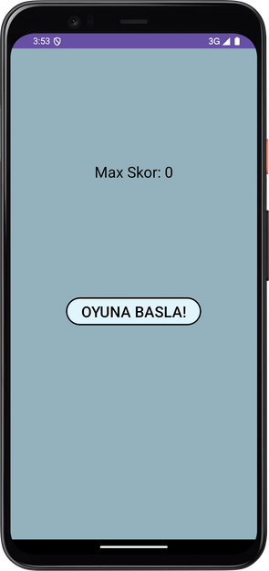
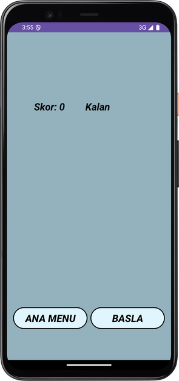
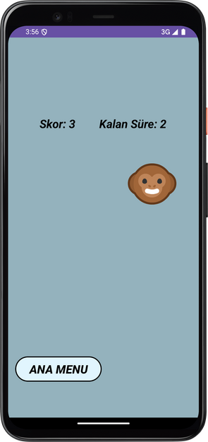
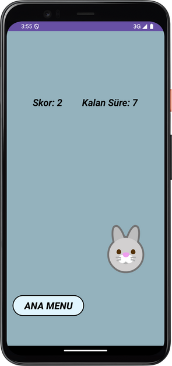
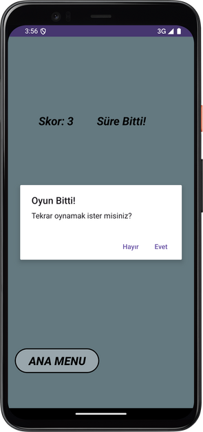
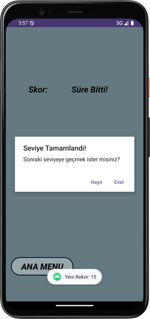
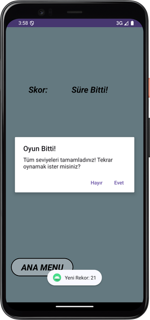

# CatchThePhoto

CatchThePhoto is an engaging Android game where players must catch photos that randomly appear on the screen within a limited time. The game features multiple levels, each with increasing difficulty as the images appear faster.

## Screenshots

### Main Screen

### Play Screen

### Level Messages

## Features

- **Multi-Level Gameplay:** Three levels with increasing difficulty.
- **Score Tracking:** Tracks the player's score and maintains the highest score using SharedPreferences.
- **Interactive UI:** Simple and user-friendly interface with clickable images.
- **Level Progression:** Players advance through levels by achieving the required score.

## Technologies Used

- **Java:** The primary programming language used for the application.
- **Android Studio:** The integrated development environment (IDE) used for development.
- **SharedPreferences:** For storing and retrieving the highest score.
- **CountDownTimer:** For managing the game timer.
- **Handler and Runnable:** For controlling the appearance of images.
- **Material Design**:For a modern and user-friendly UI/UX.
- **Git & GitHub:** Version control and collaboration.

## How to Install

1. Clone the repository from GitHub:
   git clone https://github.com/BBakann/IconicPlaceDirectory.git
